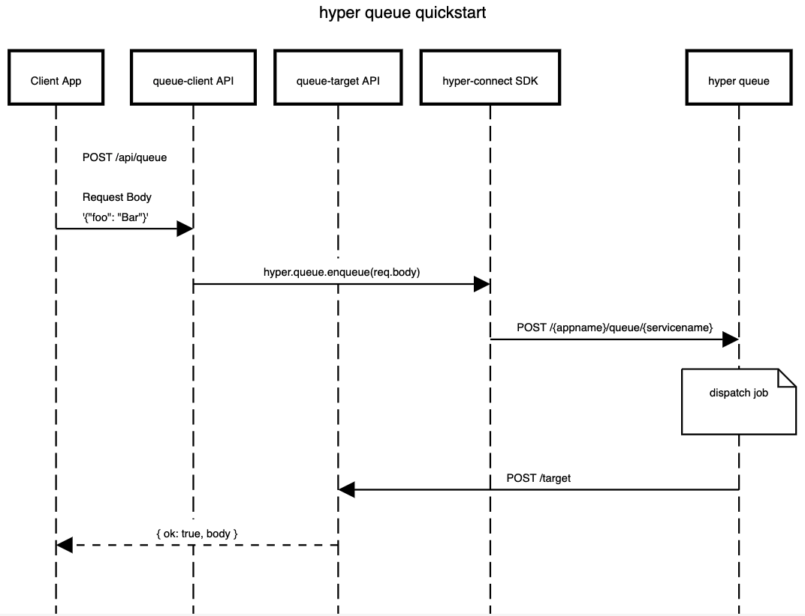

# Queue Quickstart

## Introduction

The hyper Queue service provides the ability to perform background processing without having to manage your own queue servers. It works great for server-less implementations that need to offload short-lived processes to prevent slow-running transactions for the client application.

## Need Help?

Be sure to checkout our [workshops](https://github.com/hyper63/workshops-expressjs) for a guided tour of common use cases. 

## Prerequisites

Here's what you need to know:

- HTTP/JSON APIs
- Javascript and Promises
- ExpressJS - NodeJS (https://nodejs.org)
- git/github
- curl

## What you will learn

- [Create a hyper cloud application](https://docs.hyper.io/cloud/applications#zl-creating-a-new-hyper-application).
- Create a new queue instance named "default" within our hyper cloud application.
- Obtain a [connection string](https://docs.hyper.io/cloud/app-keys#6s-copying-the-key-secret-and-connection-string) from your [app key](https://docs.hyper.io/cloud/app-keys).
- Use Express middleware to verify the incoming target request from hyper queue

## Setup

This quickstart involves two separate APIs:  the **queue-client** folder contains the 'queue client API' that will send (enqueue) a message to hyper queue.  Once the hyper queue service receives a message, it will perform an HTTP POST to the configured queue target API. The **queue-target** folder contains the 'queue target API'.

> The queue target API must be publically addressable.  We recommend using GitPod for this quickstart as it will enable you to run the target API publically. 

your client --> queue-client API --> hyper-connect.queue.enqueue --> hyper queue  --> queue-target API --> your client

### Setup Step 1: Setting a hyper app connection string to the **queue-client** API.

You'll need a hyper cloud app and app key for your queue-client API who's job will be to accept a HTTP request and then send (enqueue) a message to hyper queue. 

- Go to [https://dashboard.hyper.io](https://dashboard.hyper.io) and sign in with your github account.
- [Create a hyper cloud application](https://docs.hyper.io/cloud/applications#zl-creating-a-new-hyper-application). You'll have to choose at least one service, so select the hyper Data service and then create the hyper app.  

  > We'll add a queue service to the hyper app later, after we know the queue target API public URL address.

- Create a **.env** file within the **queue-client** directory.
- Within the **.env** file, create an environment variable named `HYPER`. 
- Copy the app key's [connection string](https://docs.hyper.io/cloud/app-keys#6s-copying-the-key-secret-and-connection-string) from the newly created hyper cloud application and paste it for the value of the `HYPER` environment variable:

    ```
    HYPER=[connection string here]
    ```

- Within the terminal, ensure you are in the **queue-client** directory.
- Install dependencies 

    ```sh
    yarn
    ```

### Setup Step 2:  Starting up the **queue-client** API

- Within the terminal, ensure you are in the **queue-client** directory.
- start the API:

    ```sh
    yarn start
    ```

- The API should be running on port 3001.  Run the following curl command in your terminal to verify the API started successfully:

    ```sh
    curl localhost:3001/
    ```

    You should see a response like this:

    ```json
    {
        "name": "Quickstart Node Express JS queue-client",
        "ok": true
    }
    ```

**GitPod Instructions**

- If you are using GitPod you should be able to click Remote Explorer within your IDE, select the 3001 port and make it public.  Since the API is now publically addressable,  you can hit the API using a web browser that will be similar to something like this:  https://3001-hyper63-quickstartsexpr-e9zu4mkjvq9.ws-us30.gitpod.io/.  Your URL will be different for your specific GitPod environment.

### Setup Step 3: Setting up the **queue-target** API

The hyper queue service will be configured to POST HTTP messages to the **queue-target** API.  The **queue-target** API responsiblities are to provide a target endpoint that accepts a POST from hyper queue and optionally verify the signature of the incoming HTTP request using the secret configured within the hyper app queue service instance.  

- Create a **.env** file within the **queue-target** directory.
- Within the **.env** file, create an environment variable named `WORKER_SECRET`. 
- Set the value of the `WORKER_SECRET` environment variable to a secret of your choosing:
  
  ```
  WORKER_SECRET=[your secret goes here]
  ```
- Within the terminal, ensure you are in the **queue-target** directory.
- Install dependencies 

    ```sh
    yarn
    ```

### Setup Step 4: Starting your **queue-target** API

- Within the terminal, ensure you are in the **queue-target** directory.
- Start the API:

    ```sh
    yarn start
    ```

- The API should be running on port 3002.  Run the following curl command in a terminal to verify the API started successfully:

    ```sh
    curl localhost:3002/
    ```

    You should see a response like this:

    ```json
    {
        "name": "Quickstart Node Express JS queue-target",
        "ok": true
    }
    ```

### Setup Step 5: Take the **queue-target** API's `POST /target` endpoint for a test drive.

Using curl, submit the following HTTP `POST` request to the `/target` endpoint.  

> Since we are omitting the `x-hyper-signature` header, you should receive a `401-Unauthorized` error.  

```sh
 curl -X POST localhost:3002/target -H 'Content-Type: application/json' -d '{ "foo": "bar" }'
```

**GitPod Instructions**

If you are using GitPod you should be able to click Remote Explorer within your IDE, select the 3002 port and make it public.  Since the API is now publically addressable,  you can hit the API using a URL similar to this:  https://3002-hyper63-quickstartsexpr-e9zu4mkjvq9.ws-us30.gitpod.io/.  Your URL will be different for your specific GitPod environment.

> Since we are omitting the `x-hyper-signature` header, you should receive a `401-Unauthorized` error.  

```sh
 curl -X POST https://3002-hyper63-quickstartsexpr-e9zu4mkjvq9.ws-us30.gitpod.io/target -H 'Content-Type: application/json' -d '{ "foo": "bar" }'
```


## Setup Part 6: Adding a queue service instance to your hyper app

>  Before proceeding, your **queue-target** API must be publically addressable on the interwebs. If not, the hyper queue service won't be able to locate your target API.

- Assuming you have created your hyper app, open the hyper dashboard, locate your hyper app and select the **Queue** tab, and [create a queue service](https://docs.hyper.io/cloud/adding-a-queue-service).  Provide the following values in the **Add Queue Service** form:

| Field | Desc |
| ----- | ---- |
| Service Name | Provide the desired name for your queue service, or except the value: "default". |
| Target URL  | The publically available URL to your target API service. Example: https://3002-hyper63-quickstartsexpr-e9zu4mkjvq9.ws-us30.gitpod.io/target |
| Secret | Provide the same value used for the `WORKER_SECRET` environment variable in Setup Step 3. |


## The big enchilada

Now it time to submit a request to the **queue-client** API, which will use the `hyper-connect` SDK to send a message to the hyper queue.  Once received, hyper queue will process the job and call the configured **queue-target** API passing along the original payload to the target. 




- In a separate terminal, ensure you are in the **queue-client** directory and start the API via `yarn start`. The **queue-client** API should be available on port 3001.
- In a separate terminal, ensure you are in the **queue-target** directory and start the API via `yarn start`. The **queue-target** API should be available on port 3002.
- In a third terminal, run the following command to POST a message to the API.

```sh
curl -X POST localhost:3001/api/queue -H 'Content-Type: application/json' -d '{ "foo": "bar" }'
```

If all goes well you should see a response similar to this within the **queue-target** API terminal window (in may take a few seconds to process, initially.):

```json
post.js body { foo: 'bar' }
```

Congratulations, you have successfully navigated the hyper queue quickstart.